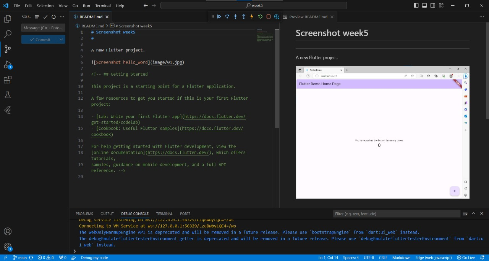
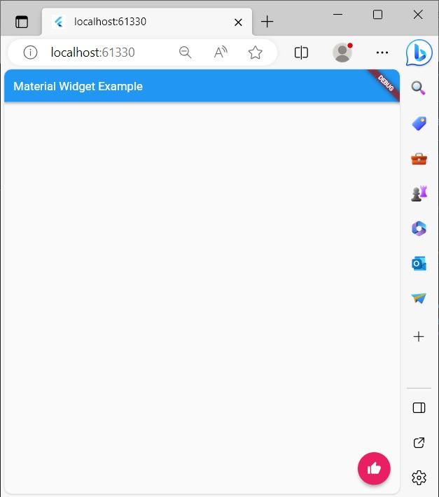
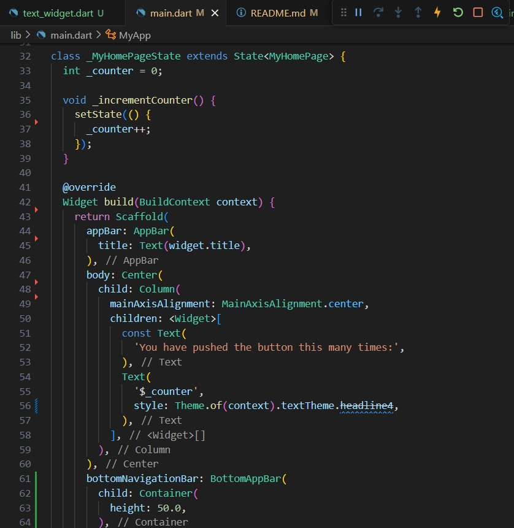

Nama : Mirza Priscilla Faradiba
----------------------------
Kelas : TI-3A 
----------------------------
No.Absen : 18
----------------------------

----------------------------
# Flutter Fundamental - Bagian 1
----------------------------
# Praktikum 2
# Membuat Repository GitHub dan Laporan Praktikum

Langkah 11-12

# Praktikum 3
# Menerapkan Widget Dasar

Langkah 1: Text Widget

Langkah 2: Image Widget

# Praktikum 4
# Menerapkan Widget Material Design dan iOS Cupertino

Langkah 1: Cupertino Button dan Loading Bar

Langkah 2: Floating Action Button (FAB)

Langkah 3: Scaffold Widget

Langkah 4: Dialog Widget

Langkah 5: Input dan Selection Widget

Langkah 6: Date and Time Pickers

